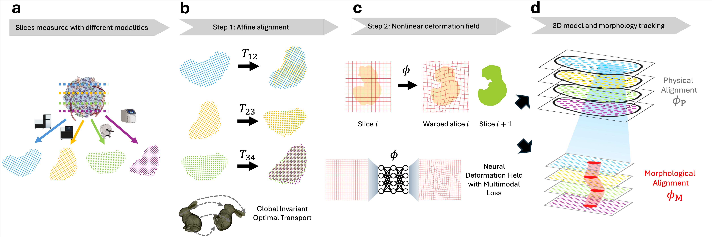

# MOSAICField



This is the codebase for MOSAICField (MultimOdal Spatial Alignment and Integration with Coordinate neural Field), a computational method to perform physical and morphological alignment on spatial slices from multiple modalities.

There are three main functions:
1. `src/MOSAICField/affine_alignment/affine_align`: Given a pair of spatial slices in h5ad, potentially from different modalities, performs affine alignment to find an affine transformation registering one slice onto the other.
2. `src/MOSAICField/nonlinear_alignment/nonlinear_align`: Given a pair of physically aligned slices in the form of images of shape (C1, H, W) and (C2, H, W), computes a nonlinear deformation field that nonlinearly registers the source slice onto the target slice.
3. `src/MOSAICField/nonlinear_alignment/warp_image`: Applies the learned deformation field to the source image so that it is resampled in the target coordinate system. Internally we follow the common Spatial Transformer convention: a displacement field at target pixel location x specifies where to sample in the (original) source image. Thus, while conceptually you can think of the field as "forward: source → target", the stored tensor actually encodes the inverse sampling map (target coords → source coords) used for interpolation.
4. `src/MOSAICField/nonlinear_alignment/warp_image_reverse`: Uses the same deformation field to warp the target image back toward the source (i.e. resamples the target in the source coordinate system). This function additionally returns `phi`, which we expose as the explicit forward deformation field (source → target). We reconstruct `phi` from the internally stored inverse-style field because Spatial Transformer operate with reverse (target → source) sampling grids; returning `phi` avoids confusion and gives you the direct forward mapping for downstream analysis or composition.


## Usage
### Affine Alignment
To perform affine alignment, use the `affine_align` function:
```python
from src.MOSAICField.affine_alignment import affine_align

slice1_aligned, slice2_aligned, affine_transformation, mapping = affine_align(slice1, slice2, max_iter=10, alpha=0.8)
```
### Nonlinear Alignment
To perform nonlinear alignment, first do `affine_align`, then use the `nonlinear_align` function. Note that here source and target slices are in the form of images:
```python
from src.MOSAICField.nonlinear_alignment import nonlinear_align

from types import SimpleNamespace
config = {
    "epoches": 1000,
    "lr": 0.005,
    "lambda_J": 2.5,
    "lambda_v": 0.000005,
    "device": "cuda:1"
}
config = SimpleNamespace(**config)

source = torch.from_numpy(img_source).permute(2, 0, 1) # [C1, H, W]
target = torch.from_numpy(img_target).permute(2, 0, 1) # [C2,H, W]
warped_source, pred_field, network = nonlinear_align(config, source, target)
warped_source = warped_source.permute(1, 2, 0).detach().cpu().numpy()  # [H, W, C1]
```

### Example
We have provided a tutorial notebook `tutorial.ipynb` to walk through the MOSAICField algorithm on simulated data.

## Note
This is a very preliminary version of the codebase to get you started on using our tool. We are actively working on the project and will include more functionalities soon.

## Contact
If you encounter any problem running the software, please contact Xinhao Liu at xl5434@princeton.edu or Hongyu Zheng at hz7140@princeton.edu.
